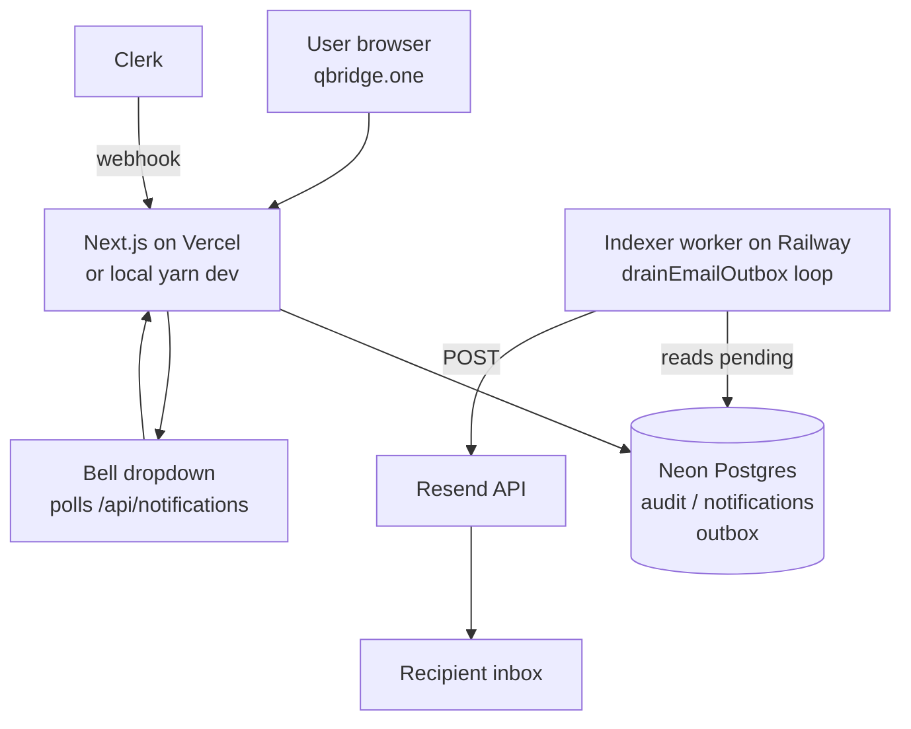

# Notifications, email & external providers

This document is the reference for how QBridge sends notifications, where each piece runs, and what to configure for **local dev** vs **production at qbridge.one**.

If a feature ever stops working in either environment, start here.

---

## 1. The big picture

QBridge is multi-tenant: every event in the platform has to fan out to the **right people on the right plane** (ops staff vs. an issuer's own admins). We do this in two pieces:

| Layer | Job |
|---|---|
| **In-app notifications** (bell + dropdown) | Per-recipient rows in Postgres. Polled by the client every 30 s. |
| **Email** | Same fanout writes a pending row to a Postgres outbox; a long-running worker drains it and POSTs to Resend. |

The "trigger" is always **inside QBridge** (ops action in the UI, issuer submitting a form). A Clerk webhook listens as a **backup** so out-of-band changes to Clerk metadata still produce notifications, but the platform owns its own state machine.

---

## 2. Provider map

| Provider | What it does | Used in dev? | Used in prod? |
|---|---|---|---|
| **Clerk** | Identity: users, orgs, memberships, sign-in/up, webhook events. | Yes (test mode keys `pk_test_…`) | Yes (live keys `pk_live_…` once you switch) |
| **Neon** | Hosted Postgres. Holds `audit_entries`, `notifications`, `notification_outbox`, plus chain indexer tables. | Yes (same DB or separate branch) | Yes |
| **Drizzle** | TypeScript ORM for Postgres + migration tooling. Not a service — runs in your app. | Yes | Yes |
| **Vercel** | Hosts the Next.js app at qbridge.one. Runs all `/api/*` routes. | No (local `yarn dev`) | Yes |
| **Railway** | Hosts the long-running indexer worker. Runs chain event watching **and the email outbox drain loop**. | Optional locally via `yarn indexer` | Yes |
| **Resend** | Transactional email API. Sends platform notifications. | Optional (defaults to `console` adapter that just logs) | Yes |
| **Zoho** | Mailbox host for `contact@qbridge.one`. Used only by `/api/contact` (marketing form). **Not** the platform notification path. | Optional | Yes |
| **Namecheap** | DNS provider for `qbridge.one`. Holds Resend's DKIM/SPF records on the `mail.` subdomain. | n/a | Yes |
| **Web3Auth** | Embedded wallet provider for issuer + investor sign-in. Unrelated to notifications. | Yes | Yes |

---

## 3. Architecture diagram

```
                       ┌──────────────────────────┐
                       │   User (browser)         │
                       │   qbridge.one            │
                       └────────────┬─────────────┘
                                    │
                       sign-up/in   │   issuer KYB submit
                       ──────────►  │   ops approve / reject
                                    ▼
        ┌───────────────────────────────────────────────────────┐
        │  Next.js app on Vercel  (production)                  │
        │  or  yarn dev  (local)                                │
        │                                                       │
        │  ┌────────────────────────────────────────────────┐   │
        │  │ /api/onboarding/kyb          → submit          │   │
        │  │ /api/ops/issuers/.../kyb/decision  → decide    │   │
        │  │ /api/notifications  /  read-all  /  [id]       │   │
        │  │ /api/webhooks/identity  ← Clerk webhook        │   │
        │  └────────────────────────┬───────────────────────┘   │
        │                           │ writes via Drizzle        │
        └───────────────────────────┼───────────────────────────┘
                                    ▼
                    ┌──────────────────────────────┐
                    │  Neon (Postgres)             │
                    │  ┌────────────────────────┐  │
                    │  │ audit_entries          │  │
                    │  │ notifications          │  │  ← bell polls
                    │  │ notification_outbox    │  │  ← drain reads
                    │  │ access_managers …      │  │
                    │  └────────────────────────┘  │
                    └─────────────┬────────────────┘
                                  │  SELECT pending
                                  ▼
        ┌───────────────────────────────────────────────────────┐
        │  Indexer worker on Railway  (long-lived process)      │
        │                                                       │
        │  - watchAll(chains)      ← block events               │
        │  - startEmailOutboxDrainLoop()                        │
        │       every 2 min: lease N pending rows → send        │
        └────────────────────────┬──────────────────────────────┘
                                 │ HTTPS POST
                                 ▼
                    ┌──────────────────────────────┐
                    │  Resend  (transactional)     │
                    │  From: notifications@        │
                    │        mail.qbridge.one      │
                    └─────────────┬────────────────┘
                                  ▼
                    ┌──────────────────────────────┐
                    │  Recipient inbox             │
                    └──────────────────────────────┘


  Identity flow (separate):
      Clerk Dashboard ──webhook──►  /api/webhooks/identity
                                    ↳ mirrors users/orgs to Neon
                                    ↳ if org metadata changed and
                                      kybStatus transitioned,
                                      idempotently re-emits the
                                      same notification fanout
                                      (backup for dashboard flips)
```

### Mermaid version (GitHub renders this)



---

## 4. Notification flow, step by step

### 4.1 Issuer signs up + submits KYB

1. Issuer creates a Clerk account at `/sign-up`. Clerk auto-creates an org tagged `kind: "issuer"`, `kybStatus: "none"`.
2. Middleware redirects them to `/onboarding/kyb`.
3. They fill the form, click Submit. Browser POSTs to `/api/onboarding/kyb`.
4. Route handler calls `submitIssuerKybApplication`:
   - Writes `kybStatus: "submitted"` + a snapshot of the form to Clerk org `publicMetadata`.
   - Inserts a `kyb.submitted` row into `audit_entries`.
   - Calls `dispatchNotification` with recipient rule "members of `OPS_ORG_ID` with role `ops_admin` OR `ops_onboarding`".
5. `dispatchNotification` resolves the recipient list, then for each recipient writes:
   - One `notifications` row (powers the bell).
   - One `notification_outbox` row (queues the email).
6. The Railway worker's drain loop sees the pending outbox rows within ≤ 2 min, POSTs each to Resend, marks `sent_at`.
7. Bells of ops admins poll `/api/notifications` every 30 s and show a red badge.

### 4.2 Ops reviews + approves / rejects

1. Ops member opens `/ops/admin/issuers` (or clicks the bell notification, which deep-links to the same page with the issuer pre-selected).
2. Clicks Approve or Reject (reject requires a reason).
3. Browser POSTs to `/api/ops/issuers/:orgId/kyb/decision`.
4. Route handler calls `decideIssuerKyb`:
   - Writes `kybStatus: "approved"` or `"rejected"` + reviewer + reason to Clerk org metadata.
   - Inserts `kyb.approved` / `kyb.rejected` into `audit_entries`.
   - Fires `dispatchNotification` to "members of the issuer org with role `issuer_admin`".
5. Issuer admins get a bell + email like the ops flow above.

### 4.3 Webhook backup (out-of-band flips)

If anyone changes `kybStatus` directly in the Clerk Dashboard:

1. Clerk fires `organization.updated` to `/api/webhooks/identity`.
2. `applyAuthEvent` parses the new metadata and calls `maybeNotifyKybTransition`.
3. Same `dispatchNotification` call as the in-app paths — same `dedupeKey` (`orgId:submittedAt` or `orgId:decision:decidedAt`).
4. Partial-unique index on `(kind, org_id, user_id, dedupe_key)` collapses duplicates if both the UI write and the webhook fire — only one fanout lands.

---

## 5. Where every piece runs

| Component | Local dev | Production |
|---|---|---|
| Next.js app + all `/api/*` routes | `yarn dev` (port 3000) | Vercel auto-deploys `main` |
| Indexer + email drain loop | `yarn indexer` (optional, only if you want to test email/drain locally) | Railway service (`Dockerfile` at repo root) |
| Postgres | Neon (shared DB or a dev branch) | Neon (production branch) |
| Resend | Skipped by default (`EMAIL_PROVIDER=console`) | `EMAIL_PROVIDER=resend` |
| Clerk webhook | Skipped (Clerk can't reach `localhost`) — or use [ngrok](https://ngrok.com) to expose it | Pointed at `https://qbridge.one/api/webhooks/identity` |

---

## 6. Local dev setup (start from scratch)

### 6.1 Install + DB

```bash
yarn install
yarn db:migrate          # applies SQL migrations to whatever DATABASE_URL points at
```

### 6.2 `.env` / `.env.local`

Minimum to run the app:

```bash
# Identity
IDENTITY_PROVIDER=clerk                                # or "memory" for the dev fixture
NEXT_PUBLIC_CLERK_PUBLISHABLE_KEY=pk_test_...
CLERK_SECRET_KEY=sk_test_...
CLERK_WEBHOOK_SECRET=whsec_...                         # only if you set up the webhook locally

# Database
DATABASE_URL=postgres://...                            # Neon connection string

# Notifications + email
OPS_ORG_ID=org_xxx                                     # see §6.3
EMAIL_PROVIDER=console                                 # logs sends to terminal, no real email
# OR (real sends locally):
# EMAIL_PROVIDER=resend
# RESEND_API_KEY=re_...
# EMAIL_FROM="QBridge <notifications@mail.qbridge.one>"

# Cron route (only needed if you'll curl /api/cron/drain-emails)
CRON_SECRET=any_long_random_string

# Wallet provider (not notification-related)
NEXT_PUBLIC_WALLET_PROVIDER=web3auth
NEXT_PUBLIC_WEB3AUTH_CLIENT_ID=...
```

### 6.3 Set up your ops org in Clerk

Notifications for `kyb.submitted` need an ops org to fan out to:

1. Clerk Dashboard → **Organizations** → **Create organization** → name it "QBridge Ops".
2. Click into it → **Metadata** → **Public metadata** → set:
   ```json
   { "kind": "ops" }
   ```
3. Make yourself a member (or the org creator already is — Clerk's `org:admin` maps to `ops_admin` automatically).
4. Copy the org id (`org_xxx`) into `OPS_ORG_ID`.

### 6.4 Running it

```bash
yarn dev                 # http://localhost:3000
```

In a second terminal (only if you want real emails delivered while developing):

```bash
yarn indexer             # runs the chain watcher AND the email drain loop
```

If you don't want to run the indexer locally, you can manually drain the outbox:

```bash
curl -H "Authorization: Bearer $CRON_SECRET" http://localhost:3000/api/cron/drain-emails
```

---

## 7. Production setup (qbridge.one)

Three platforms to configure — keep them in sync.

### 7.1 Vercel (hosts the app)

**Settings → Environment Variables** — for the **Production** environment:

```bash
# Identity (live Clerk if you've switched, otherwise the same test keys)
IDENTITY_PROVIDER=clerk
NEXT_PUBLIC_CLERK_PUBLISHABLE_KEY=pk_live_...
CLERK_SECRET_KEY=sk_live_...
CLERK_WEBHOOK_SECRET=whsec_...                         # the prod webhook secret from Clerk Dashboard

# DB
DATABASE_URL=postgres://...

# Notifications + email
OPS_ORG_ID=org_xxx                                     # ops org id in the *prod* Clerk instance
EMAIL_PROVIDER=resend
RESEND_API_KEY=re_...
EMAIL_FROM="QBridge <notifications@mail.qbridge.one>"

# Manual drain route guard (Railway worker does the routine drain;
# this protects on-demand curl calls)
CRON_SECRET=any_long_random_string

# Wallet
NEXT_PUBLIC_WALLET_PROVIDER=web3auth
NEXT_PUBLIC_WEB3AUTH_CLIENT_ID=...

NEXT_PUBLIC_APP_URL=https://qbridge.one
```

After saving, click **Redeploy** on the latest deployment so the new vars take effect.

### 7.2 Railway (hosts the indexer + email drain)

**Service → Variables**:

```bash
DATABASE_URL=postgres://...                            # same as Vercel
NEXT_PUBLIC_SEPOLIA_RPC_URL=https://...                # chain RPC
NEXT_PUBLIC_PLATFORM_AM_SEPOLIA=0x...                  # AM addresses
NEXT_PUBLIC_TOKEN_AM_SEPOLIA=0x...

# Notifications + email (same values as Vercel)
EMAIL_PROVIDER=resend
RESEND_API_KEY=re_...
EMAIL_FROM="QBridge <notifications@mail.qbridge.one>"
```

Railway redeploys automatically when `main` advances on GitHub. The indexer logs `[email-outbox] drain loop started (2 min interval)` on boot.

### 7.3 Clerk (prod instance)

If you switched Clerk from Development to Production mode, you'll have a fresh instance — recreate:

1. **API Keys** → copy `pk_live_…` and `sk_live_…` into Vercel.
2. **Webhooks** → create endpoint at `https://qbridge.one/api/webhooks/identity`, copy `whsec_…` into Vercel as `CLERK_WEBHOOK_SECRET`, subscribe to the events the app already handles (user, organization, organizationMembership, organizationInvitation).
3. **Organizations** → create your ops org with `publicMetadata: { kind: "ops" }`, copy its `org_xxx` into Vercel as `OPS_ORG_ID`.

### 7.4 Resend

1. **Domains** → add `mail.qbridge.one` (subdomain — keeps Zoho's apex records untouched).
2. Resend gives you DKIM/SPF/MX records to add at Namecheap.
3. Wait for "Verified" status, then `EMAIL_FROM=…@mail.qbridge.one` works.
4. **Do not** add Resend's inbound MX (Receiving) — that conflicts with Zoho.

### 7.5 Namecheap

Three records on the `mail.qbridge.one` subdomain (copy exactly what Resend's dashboard shows):

| Type | Host | Value |
|---|---|---|
| TXT | `resend._domainkey.mail` | `p=MIGfMA…` (DKIM) |
| MX | `send.mail` | `feedback-smtp.us-east-1.amazonses.com` (priority 10) |
| TXT | `send.mail` | `v=spf1 include:amazonses.com ~all` |
| TXT (optional) | `_dmarc.mail` | `v=DMARC1; p=none;` |

Leave the apex `qbridge.one` records alone — they're Zoho's.

---

## 8. Env-var reference

| Var | Where it's read | Required in dev? | Required in prod? |
|---|---|---|---|
| `IDENTITY_PROVIDER` | Container picks Clerk vs memory adapter | Yes (use `clerk`) | Yes |
| `NEXT_PUBLIC_CLERK_PUBLISHABLE_KEY` | Clerk client | Yes | Yes |
| `CLERK_SECRET_KEY` | Clerk server | Yes | Yes |
| `CLERK_WEBHOOK_SECRET` | `/api/webhooks/identity` | Only if testing the webhook locally | Yes |
| `DATABASE_URL` | Drizzle client + migrations | Yes | Yes |
| `OPS_ORG_ID` | `submitIssuerKybApplication`, webhook backup | Yes (for ops fanout) | Yes |
| `EMAIL_PROVIDER` | Container picks `resend` vs `console` | No (default `console`) | Yes (`resend`) |
| `RESEND_API_KEY` | Resend adapter | Only when `EMAIL_PROVIDER=resend` | Yes |
| `EMAIL_FROM` | Resend adapter default sender | Only when `EMAIL_PROVIDER=resend` | Yes |
| `CRON_SECRET` | `/api/cron/drain-emails` route guard | Optional (only for manual drain) | Optional but recommended |
| `NEXT_PUBLIC_APP_URL` | Invite redirect URL | Optional | Recommended |
| `NEXT_PUBLIC_WALLET_PROVIDER` | Wallet adapter | Yes | Yes |
| `NEXT_PUBLIC_WEB3AUTH_CLIENT_ID` | Web3Auth | Yes | Yes |
| `NEXT_PUBLIC_SEPOLIA_RPC_URL` | Indexer + transaction service | Only when running indexer | Yes (Railway) |

---

## 9. Troubleshooting

### Nothing in `notification_outbox`
- Did you actually submit the KYB form (POST), or just view the page?
- Is `OPS_ORG_ID` set? Without it the route writes audit but skips fanout.
- Is the deployment up to date? Vercel → Deployments → top commit should match the latest on `main`.

### Outbox rows piling up, none sending
- Is the Railway service running? Check Railway logs for `[email-outbox] drain loop started`.
- If not running: check `DATABASE_URL` and `RESEND_API_KEY` on Railway.
- Manual fallback: `curl -H "Authorization: Bearer $CRON_SECRET" https://qbridge.one/api/cron/drain-emails`.

### Specific row failing — check `last_error`
```sql
SELECT to_address, attempts, last_error
FROM notification_outbox
WHERE sent_at IS NULL AND last_error IS NOT NULL;
```

Common errors:
- `domain not verified` → finish the Resend DNS on `mail.qbridge.one`.
- `You can only send testing emails to your own email address` → Resend sandbox restriction; either verify your domain or temporarily set `EMAIL_FROM="QBridge <onboarding@resend.dev>"`.
- `429 Too Many Requests` → handled automatically by the dispatcher's 220 ms throttle, but if Resend rate-limits get tighter, lower batch size or raise `throttleMs`.

### Bell shows nothing, even though `notifications` has rows
- The bell only renders rows where `user_id` matches the signed-in user's Clerk id. Verify with:
  ```sql
  SELECT user_id, kind, read_at IS NULL as unread, title
  FROM notifications ORDER BY created_at DESC LIMIT 10;
  ```
- A user only sees a notification if `user_id` exactly matches their `clerk_user_id`.

### Audit row exists but no notifications row
- That's expected if `OPS_ORG_ID` was unset at the time of submit — audit writes unconditionally, fanout is guarded.
- Fix the env var, then either re-submit (after a reject), or manually trigger the webhook backup by changing org metadata in Clerk Dashboard.

---

## 10. Where the code lives

| Concern | File |
|---|---|
| Domain types | `src/lib/core/notification.ts`, `src/lib/core/issuer-kyb.ts`, `src/lib/core/identity.types.ts` |
| Ports | `src/lib/ports/notification.port.ts`, `src/lib/ports/email.port.ts`, `src/lib/ports/organization.port.ts` |
| Adapters (DB) | `src/lib/adapters/notification/drizzle.adapter.ts`, `src/lib/adapters/audit-log/drizzle.adapter.ts` |
| Adapters (email) | `src/lib/adapters/email/resend.adapter.ts`, `src/lib/adapters/email/console.adapter.ts` |
| Service (fanout + drain) | `src/lib/services/notification.service.ts` |
| Service (KYB lifecycle) | `src/lib/services/onboarding.service.ts` |
| Webhook backup | `src/lib/services/identity-mirror.service.ts` |
| Drain loop wiring | `src/scripts/indexer.ts` |
| Container / env switches | `src/lib/container.server.ts` |
| Schema + migration | `src/lib/db/schema.ts`, `src/lib/db/migrations/0001_*.sql` |
| UI (bell) | `src/components/notifications/NotificationBell.tsx` |
| UI (ops queue) | `src/components/ops/IssuerReviewQueue.tsx`, `src/app/ops/admin/issuers/page.tsx` |
| Routes | `src/app/api/notifications/*`, `src/app/api/ops/issuers/[orgId]/kyb/decision/route.ts`, `src/app/api/cron/drain-emails/route.ts` |
